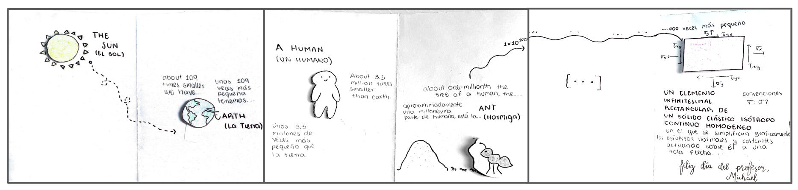

# Mecánica del medio continuo

<p align="center">
 
</p>

Este repositorio contiene el material académico de las asignaturas del área de mecánicas del medio continuo dictadas en la **Universidad Nacional de Colombia – Sede Manizales**. Aquí se encuentran notas de clase, presentaciones, códigos de apoyo y documentación académica relevante para el desarrollo de los cursos.


## Asignaturas

- **4200687 – Mecánica Tensorial** (4 créditos)  
- **4100611 – Mecánica de Sólidos 1** (3 créditos)

Información sobre créditos académicos puede consultarse en:  
[Créditos](informacion/credito.md)


## Organización del repositorio

El repositorio se encuentra organizado en las siguientes secciones principales:

### Información general del curso

La carpeta `informacion/` contiene documentos académicos y administrativos que definen el contexto del curso, los prerrequisitos, la metodología de evaluación y recomendaciones generales para el estudio.

- [Prerrequisitos](informacion/00_prerrequisitos.md)
- [Bibliografía y material recomendado](informacion/01_bibliografia_material.md)
- [Software recomendado](informacion/02_software_recomendado.md)
- [Sobre las notas de clase (main.pdf)](informacion/03_sobre_el_main.md)
- [Calificación y evaluación](informacion/04_calificacion.md)
- [Guía de estudio](informacion/05_guia_estudio.md)
- [Sobre el uso de la IA como herramienta de estudio](informacion/06_sobre_ia.md) 

Se recomienda leer esta información **al inicio del semestre**.


### Contenido de las asignaturas

La descripción oficial de los contenidos y el alcance de cada curso se encuentra en los siguientes documentos:

- [Mecánica Tensorial – Contenido del curso](informacion/a_contenido_tensorial.md)
- [Mecánica de Sólidos 1 – Contenido del curso](informacion/b_contenido_solidos.md)


### Material académico

En estas carpetas se encuentran las diapositivas, ejemplos computacionales y material complementario utilizado durante el semestre:

- [Presentaciones de clase](documentos/readme.md)  
- [Códigos de apoyo](codigos/readme.md)


## Descarga del material

El repositorio puede clonarse desde la terminal mediante:

```bash
git clone https://github.com/michaelherediaperez/medio-continuo.git
```

También es posible descargar el contenido directamente desde la interfaz web de GitHub.


## Sizes of things

<p align="center">
 
</p>

Por Jacobo :)


## Profesor

**Michael Heredia Pérez**

- Correo institucional: [mherediap@unal.edu.co](mailto:mherediap@unal.edu.co)  
- LinkedIn: https://www.linkedin.com/in/michael-heredia-perez