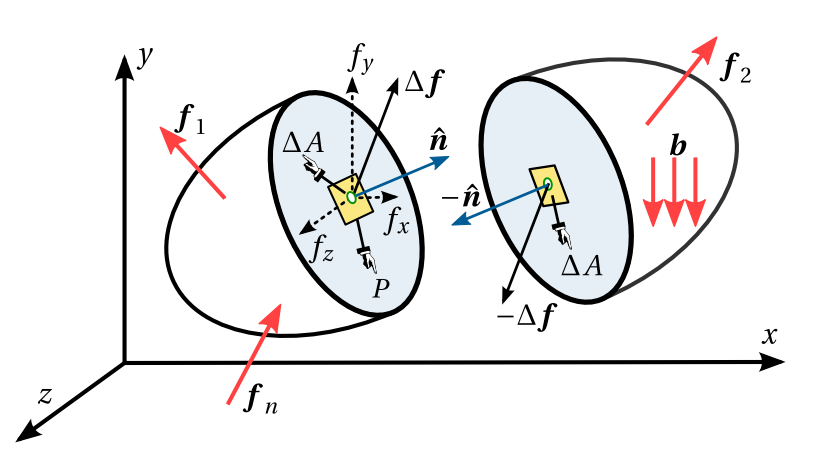

# 4100611- Mecánica de Sólidos (G2)

 

El presente es el repositorio para el **grupo 2** del curso de Mecánica de Sólidos de la Universdidad Nacional de Colombia sede Manizales.

| Profesor                          | Michael Heredia Pérez, [mherediap@unal.edu.co](mherediap@unal.edu.co) |
| ---                               | ---                                                                   |
| Semestre en curso                 | 2022b, 16 semanas                                                     |
| [Créditos](informacion/credito.md)| 3                                                                     |
| Horario                           | miércoles (10:00 a.m. - 12:00 m) y jueves (8:00 a.m. - 10:00 a.m.)    |

## Presentación

En este curso se profundizará en la teoría de la elasticidad. Esta es una teoría básica, imprescindible para poder entender, con suficiencia, el método de los elementos finitos, y con el tener bases apropiadas para poder manejar con criterio los diferentes programas de análisis estructural que existen en el mercado, que son empleados no solo en ingeniería estructural, sino en ingeniería geotécnica y de pavimentos.

Partiendo de los conocimientos previos sobre tensiones y deformaciones, adquiridos en el curso de mecánica tensorial, el curso se desarrolla estudiando en profundidad las relaciones entre esfuerzos y deformaciones para materiales elásticos lineales, las ecuaciones fundamentales de la teoría de la elasticidad, las teorías de falla de materiales dúctiles y frágiles y finaliza con la formulación elástica en coordenas cilíndricas, lo cual es de especial importancia no solo en la mecánica estructural sino en la de suelos.

Se espera que al final del curso, el estudiante esté en capacidad de:
* Analizar y explicar como varían las tensiones y las deformaciones al interior de un sólido elástico.
* Entender las diferentes suposiciones y limitaciones presentes en la teoría de la elasticidad.
* Interpretar los diferentes criterios de falla presentes en los sólidos elásticos.
* Entender la deducción y rango de aplicación de ciertas formulaciones que se aplicarán más tarde en las líneas de mecánica de suelos y pavimentos.

La materia se desarrollará mediante clases magistrales y prácticas mediante el uso de [notebooks](codigos/readme.md) y programas de elementos finitos.

## Índice

Remítase a la siguiente información:

01. [Contenido del curso](informacion/01_contenido_curso.md)
02. [Bibliografía y material recomendado](informacion/02_bibliografia_material.md)
03. [Software recomendado](informacion/03_software_recomendado.md)
04. [Sobre el main.pdf](informacion/04_sobre_el_main.md)
05. [Calificación](informacion/05_calificacion.md)
06. [Presentaciones de clase](documentos/readme.md)

Adicionalmente, el repositorio del profesor Diego Andrés Álvarez, mentor del curso: <https://github.com/diegoandresalvarez/solidos>
