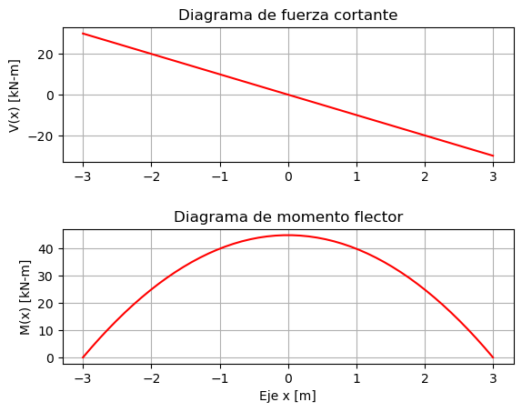

# Códigos en Python

## Mecánica tensorial

Códigos hechos por el profesor Diego Andrés Álvarez:

- [Descomposición polar](https://github.com/diegoandresalvarez/tensorial/blob/main/codigo/Descomposici%C3%B3n%20polar.ipynb)
- [Gradiente de deformación](https://github.com/diegoandresalvarez/tensorial/blob/main/codigo/Gradiente%20de%20deformaci%C3%B3n%20F.ipynb)
- [Símbolo de Levi-Civita](https://github.com/diegoandresalvarez/tensorial/blob/main/codigo/S%C3%ADmbolo%20de%20Levi-Civita.ipynb)
- [Los tensores de Green-Lagrange y de Euler-Almansi](https://github.com/diegoandresalvarez/tensorial/blob/main/codigo/tensor_lagrangiano_euleriano.ipynb)


## Traducciones del main.pdf

A continaución encontrará un índice para acceder a las traducción de los códigos del ```main.pdf```, que están hechos en lenguaje MAXIMA y en Matlab, a [Python](https://www.python.org/); a excepción de unos pocos, estos están en formato ```.ipynb``` porque son *Python Interactive Notebooks* o *IPython Notebooks*.

Si quiere correr por usted mismo uno de los cuadernos, o hacer una copia para estudiar y modificarlo, puede hacerlo desde el botón de la esquina superior izquierda <a href="https://colab.research.google.com/?hl=es" target="_parent"></a> que tienen todos los notebooks. O, descárguelo y lo trabaja en [jupyter](https://jupyter.org/).

Para más información, revise la sección de [software recomendado](../informacion/03_software_recomendado.md).

### 02. Estudio de los esfuerzos en un punto

Ver [cap_02](cap_02).

**Demostraciones**
- [02_06_01_cambio_de_base.ipynb](cap_02/02_06_01_cambio_de_base.ipynb)
- [02_06_02_sigma_bidimensional.ipynb](cap_02/02_06_02_sigma_bidimensional.ipynb)
- [02_07.ipynb](cap_02/02_07.ipynb)
- [02_08_02.ipynb](cap_02/02_08_02.ipynb)
- [02_09_07.ipynb](cap_02/02_09_07.ipynb)

**Ejemplos**
- [02_06_02_ejemplo_01.ipynb](cap_02/02_06_02_ejemplo_01.ipynb)
- [02_08_01_ejemplo_01.ipynb](cap_02/02_08_01_ejemplo_01.ipynb)
- [02_08_02_ejemplos.ipynb](cap_02/02_08_02_ejemplos.ipynb)
- [02_08_04_ejemplo.ipynb](cap_02/02_08_04_ejemplo.ipynb)
- [02_09_03_atan2.ipynb](cap_02/02_09_03_atan2.ipynb)
- [02_09_04_ejemplo.ipynb](cap_02/02_09_04_ejemplo.ipynb)

**Ejercicios**
- [02_05_ejemplo.ipynb](cap_02/02_05_ejemplo.ipynb)


**Complementarios** 
- [circulo_mohr_2d.py](cap_02/circulo_mohr_2d.py) que muestra el proceso de graficación del Círculo de Mohr en 2D. Recuerde que mientras el sólido gira en sentido antihorario, el círculo se construye en sentido horario entre [0, 180°):


Otras herramientas para estudiar el círculo de Mohr:
- Plantilla de Geogebra de los videos: <https://www.geogebra.org/m/a8nv6zud>
- <https://github.com/nicoguaro/notebooks_examples/blob/master/Mohr_circle.ipynb>
- <https://github.com/ProfessorKazarinoff/mohrs_circle>


### 03. Estudio de los desplazamientos y las deformaciones en un punto

Ver [cap_03](cap_03).

**Demostraciones**
- [03_04_exp_otras_direcciones.ipynb](cap_03/03_04_exp_otras_direcciones.ipynb)
- [03_04.ipynb](cap_03/03_04.ipynb)

**Ejemplos**
- [03_00_taylor.ipynb](cap_03/03_00_taylor.ipynb)
- [03_04_02_ejemplo.ipynb](cap_03/03_04_02_ejemplo.ipynb)
- [03_04_03_ejemplo.ipynb](cap_03/03_04_03_ejemplo.ipynb)

**Ejercicios**
- ...

### 04. Relación entre los esfuerzos y las deformaciones

Ver [cap_04](cap_04).

**Demostraciones**
- [04_03_02.ipynb](cap_04/04_03_02.ipynb)
- [04_03_03.ipynb](cap_04/04_03_03.ipynb)
- [04_09_04.ipynb](cap_04/04_09_04.ipynb)

**Ejemplos**
- [04_08_03_ejemplo_DP.ipynb](cap_04/04_08_03_ejemplo_DP.ipynb)
- [04_08_03_ejemplo_TP.ipynb](cap_04/04_08_03_ejemplo_TP.ipynb)
- [04_09_graficos_colores.ipynb](cap_04/04_09_graficos_colores.ipynb)

Estos gráficos de colores son:

- *Esfuerzos*:


- *Deformaciones*:


- *Esfuerzos principales*:


- *Diagramas*:




### 05. Ecuaciones diferencailes fundamentales de la teoría de la elasticidad

Ver [cap_05](cap_05).

**Demostraciones**
- [Verificación de las ecuaciones de Saint-Venant](https://github.com/jnramirezg/medio_continuo/blob/main/codigo/30-ecuaciones_saint_venant.ipynb)

**Ejemplos**
- [05_08_ejemplo.ipynb](cap_05/05_08_ejemplo.ipynb)

**Ejercicios**
- ...


### 06. Formulación de la teoría de la elasticidad en coordenadas cilíndricas

Ver: [https://github.com/diegoandresalvarez/solidos/tree/master/archivos/codigo/cap_06](https://github.com/diegoandresalvarez/solidos/tree/master/archivos/codigo/cap_06)


# Otros respositorios
- Profesor Nicolás Ramirez: <https://github.com/jnramirezg/mecanica_de_solidos/tree/main/codigo>