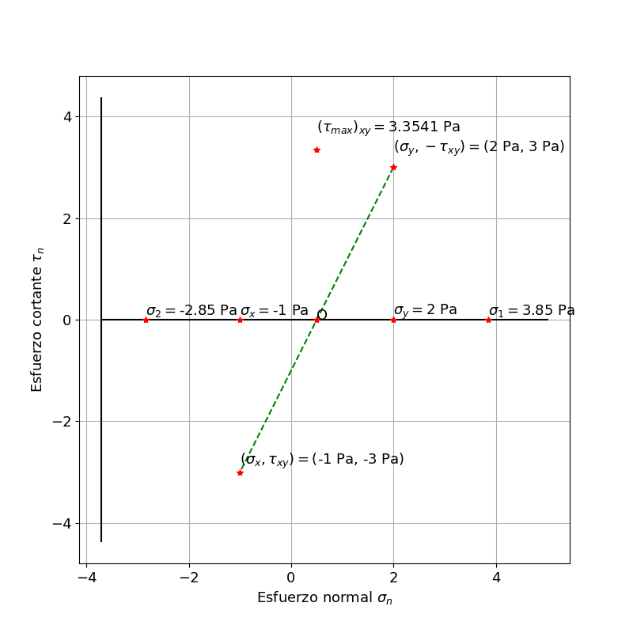
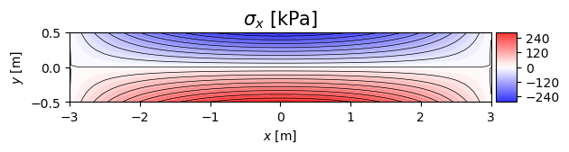
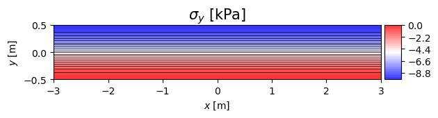
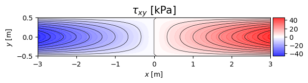
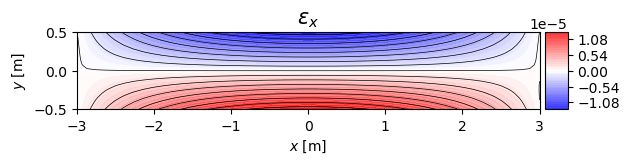
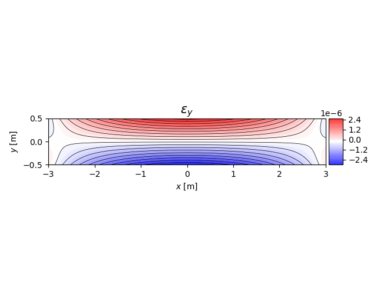
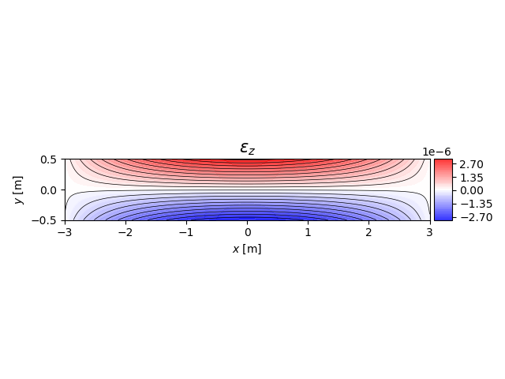
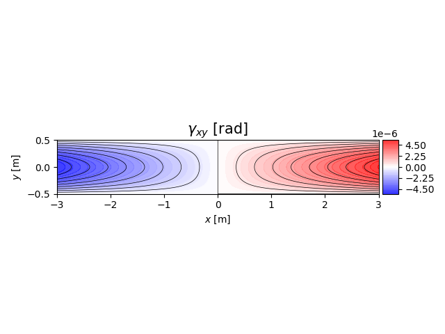
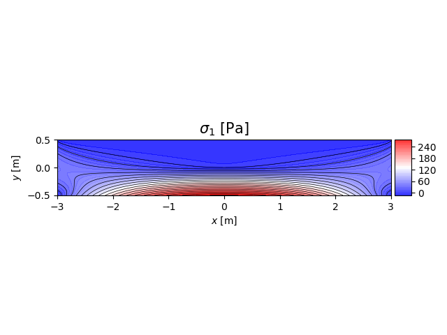
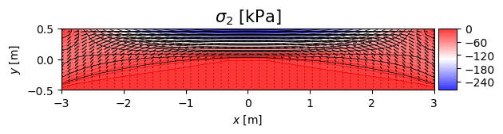

# Códigos en Python

A continaución encontrará un índice para acceder a las traducción de los códigos del ```main.pdf```, que están hechos en lenguaje MAXIMA y en Matlab, a [Python](https://www.python.org/); a excepción de unos pocos, estos están en formato ```.ipynb``` porque son *Python Interactive Notebooks* o *IPython Notebooks* creados en la plataforma [Google Colab](https://colab.research.google.com/?hl=es).

Si quiere correr por usted mismo uno de los cuadernos, o hacer una copia para estudiar y modificarlo, puede hacerlo desde el botón de la esquina superior izquierda <a href="https://colab.research.google.com/?hl=es" target="_parent"></a> que tienen todos los notebooks.

Para más información, revise la sección de [software recomendado](../informacion/03_software_recomendado.md).


### Otros respositorios
- Profesor Nicolás Ramirez: <https://github.com/jnramirezg/mecanica_de_solidos/tree/main/codigo>
- 

### Notas: 
- En la sección 2.9.3 del ```main.pdf``` se introduce la función atan2. Se menciona que las ecuaciones (2.63) y (2.66) se pueden resolver en Matlab utilizando la función ```atan2```. En Python, se puede emplear la función ```numpy.arctan2()```. Para mayores detalles consultar la [documentación](https://numpy.org/doc/stable/reference/generated/numpy.arctan2.html).


## 02. Estudio de los esfuerzos en un punto

Ver [cap_02](cap_02).

| Demostraciones                                                                    | Ejemplos                                                         |  Ejercicios |
| ---                                                                               | ---                                                              | ---         | 
| [02_06_01_cambio_de_base.ipynb](cap_02/02_06_01_cambio_de_base.ipynb)             |                                                                  |             |               
| [02_06_02_sigma_bidimensional.ipynb](cap_02/02_06_02_sigma_bidimensional.ipynb)   | [02_06_02_ejemplo_01.ipynb](cap_02/02_06_02_ejemplo_01.ipynb)    |             |
| [02_07.ipynb](cap_02/02_07.ipynb)                                                 |                                                                  |             | 
|                                                                                   | [02_08_01_ejemplo_01.ipynb](cap_02/02_08_01_ejemplo_01.ipynb)    |             |
| [02_08_02.ipynb](cap_02/02_08_02.ipynb)                                           | [02_08_02_ejemplos.ipynb](cap_02/02_08_02_ejemplos.ipynb)        |             |
|                                                                                   | [02_08_04_ejemplo.ipynb](cap_02/02_08_04_ejemplo.ipynb)          |             |
|                                                                                   | [02_09_04_ejemplo.ipynb](cap_02/02_09_04_ejemplo.ipynb)          |             |
| [02_09_07.ipynb](cap_02/02_09_07.ipynb)                                           |                                                                  |             |


Adicionalmente: 
- [circulo_mohr_2d.py](cap_02/circulo_mohr_2d.py) que muestra el proceso de graficación del Círculo de Mohr en 2D. Recuerde que mientras el sólido gira en sentido antihorario, el círculo se construye en sentido horario entre [0, 180°):



Otras herramientas para estudiar el círculo de Mohr:
- Plantilla de Geogebra de los videos: <https://www.geogebra.org/m/a8nv6zud>
- <https://github.com/nicoguaro/notebooks_examples/blob/master/Mohr_circle.ipynb>
- <https://github.com/ProfessorKazarinoff/mohrs_circle>


## 03. Estudio de los desplazamientos y las deformaciones en un punto

| Demostraciones                            | Ejemplos                                                         | Ejercicios                                                    |
| ---                                       | ---                                                              | ---                                                           |   
| [03_04_exp_otras_direcciones.ipynb](cap_03/03_04_exp_otras_direcciones.ipynb) |                               |       |
| [03_04.ipynb](cap_03/03_04.ipynb)         | [03_04_02_ejemplo.ipynb](cap_03/03_04_02_ejemplo.ipynb)          |                                                               |
|                                           | [03_04_03_ejemplo.ipynb](cap_03/03_04_03_ejemplo.ipynb)          |                                                               |
|                                           |                                                                  | [03_07_02_ejercicio.ipynb](cap_03/03_07_02_ejercicio.ipynb)   |


## 04. Relación entre los esfuerzos y las deformaciones

| Demostraciones                             | Ejemplos                                                         | Ejercicios                                                    |
| ---                                        | ---                                                              | ---                                                           |   
| [04_03_02.ipynb](cap_04/04_03_02.ipynb)    |                                                                  |                                                               |               
| [04_03_03.ipynb](cap_04/04_03_03.ipynb)    |                                                                  |                                                               |               
|                                            | [04_08_03_ejemplo_DP.ipynb](cap_04/04_08_03_ejemplo_DP.ipynb)    |                                                               |
|                                            | [04_08_03_ejemplo_TP.ipynb](cap_04/04_08_03_ejemplo_TP.ipynb)    |                                                               |
| [04_09_04.ipynb](cap_04/04_09_04.ipynb)    | [49_graficos_de_colores.py](cap_04/49_graficos_de_colores.py)    |                                                               |
 

Estos gráficos de colores son:

    NOTA: Hay que corregir los gráficos de s1, s2 y tmax porque no muestran las inclinaciones.

* Esfuerzos:




* Deformaciones:





* Principales:




## 05. Ecuaciones diferencailes fundamentales de la teoría de la elasticidad

| Demostraciones                            | Ejemplos                                                         | Ejercicios                                                    |
| ---                                       | ---                                                              | ---                                                           |   
|                                           | [05_08_ejemplo.ipynb](cap_05/05_08_ejemplo.ipynb)                |                                                               |

## 06. Formulación de la teoría de la elasticidad en coordenadas cilíndricas

| Demostraciones                            | Ejemplos                                                         | Ejercicios                                                    |
| ---                                       | ---                                                              | ---                                                           |   
