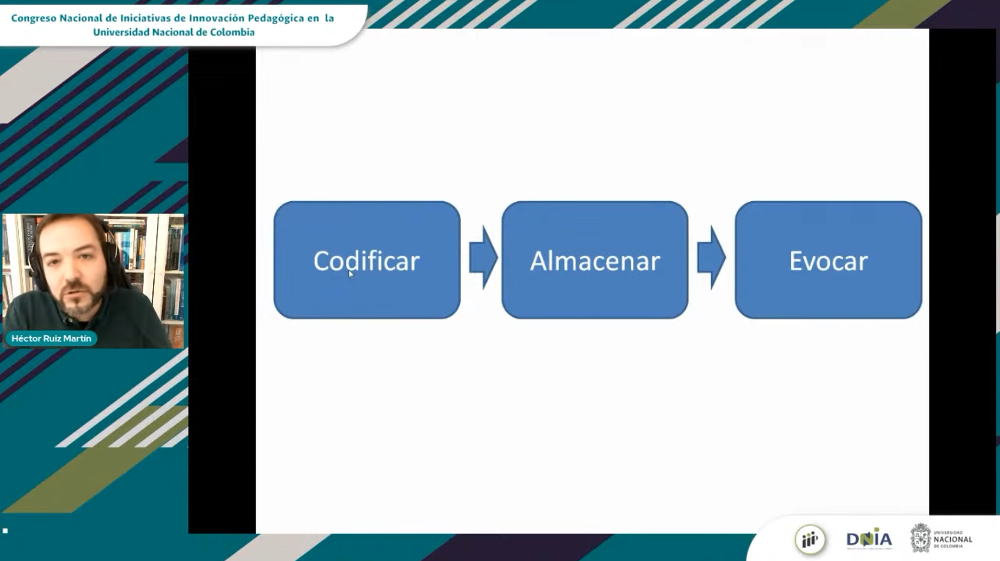
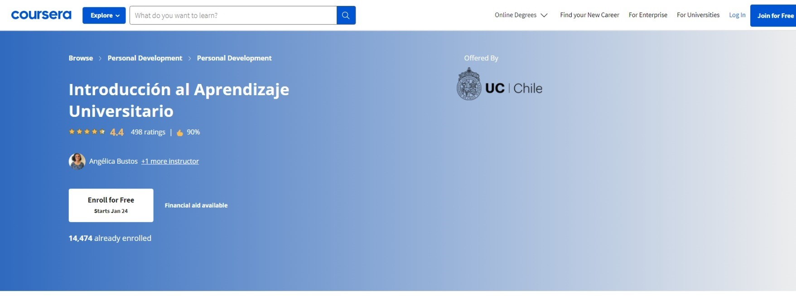

# Guías de estudio y material de ayuda

Les recomiendo que antes de comenzar a estudiar para sus materias de este semestre, se tomen el tiempo de revisar el siguiente contenido:

## Congreso Nacional de Iniciativas de Innovación Pedagógica - Sesión Inaugural 

Ver el siguiente video desde el minuto 35. Es una charla del investigador Hector Ruiz Martín, quien trabaja en el campo de la psicología cognitiva y es divulgador sobre cómo es el proceso de aprendizaje de las personas.

¿Sabes aprender? 

 

Link al video: [https://www.youtube.com/watch?v=MI-oDMh9dJs?t=2080](https://www.youtube.com/watch?v=MI-oDMh9dJs?t=2080).

## Introducción al aprendizaje universitario

 

Este es un  MOOC introductorio al aprendizaje universitario, a través del cual, el estudiante podrá conocer aspectos fundamentales que intervienen en el aprendizaje y rendimiento académico universitario. Representa a la vez una oportunidad para reflexionar sobre el propio quehacer académico como estudiante, así como una instancia para conocer distintas herramientas que promueven mejores prácticas en el contexto del estudio.

Link al curso: [https://www.coursera.org/learn/aprendizaje-universitario-introduccion](https://www.coursera.org/learn/aprendizaje-universitario-introduccion)